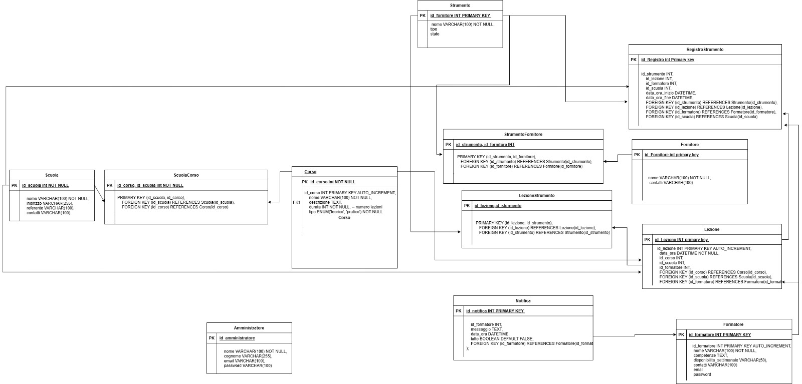

# 🧠 FABLAB INNOVACTION – Project Work

## 🔍 Richiesta Cliente
Il **FabLab InnovAction** collabora con diverse scuole per portare l’innovazione tecnologica nelle classi, organizzando laboratori pratici con strumenti come **stampanti 3D**, **kit LEGO Spike** e **Scratch**.  
Con il crescente numero di attività e scuole coinvolte, la gestione manuale (fogli di calcolo, note cartacee) è diventata inefficiente.  
Nasce quindi l’esigenza di **digitalizzare l’intero processo di gestione**, rendendolo automatizzato, ordinato e accessibile da un’unica piattaforma web.

---

## 🎯 Obiettivi del sistema
Il nuovo gestionale permette di:

- Gestire **materiali e strumenti** (prelievo, utilizzo e restituzione).  
- Tenere traccia di **insegnanti/animatori** e delle loro **disponibilità**.  
- Organizzare **lezioni e corsi**, associando scuole, formatori e strumenti.  
- Monitorare il **consumo dei materiali** e pianificare i rifornimenti.

---

## 💻 Applicazioni richieste
Il FabLab necessita di un'unica applicazione, con un grande gestionale:

**Gestione risorse e strumenti**
   - Monitoraggio magazzino, disponibilità e storico utilizzi.  
   - Segnalazioni automatiche in caso di strumenti non restituiti o guasti.

**Programmazione delle attività**
   - Pianificazione corsi e lezioni.  
   - Assegnazione dei formatori.  
   - Collegamento dei laboratori alle scuole.

---

## 👥 Ruoli utente

### 🧑‍💼 Amministratore (coordinatore)

**Può:**
- Gestire corsi, formatori, scuole e calendario comune.  
- Gestire catalogo corsi (10 corsi standard con durata predefinita).  
- Assegnare corsi acquistati da una scuola.  
- Pianificare lezioni e notificare i formatori.  
- Assegnare strumenti e monitorarne l’uso.  

**Vede:**
- Tutti i corsi e formatori.  
- Tutte le scuole registrate.  
- Tutti gli strumenti (stato, quantità, disponibilità).  
- Calendario comune.

---

### 👨‍🏫 Formatore

**Può:**
- Visualizzare solo i **propri corsi e lezioni**.  
- Ricevere **notifiche automatiche** sulle lezioni assegnate.  
- Confermare o richiedere modifiche.  
- Segnalare quali strumenti utilizzerà.  
- Registrare l’attività completata → strumenti tornano disponibili.  

**Vede:**
- Propri corsi e lezioni.  
- Strumenti assegnati e loro disponibilità.  
- Storico personale e notifiche.

---

## 💡 Idea innovativa

### 🧠 Interfaccia “Lavagna Moderna”
Dashboard dal design minimal e intuitivo:
- Cards pulite, icone dinamiche, layout tipo **dashboard interattiva**.  
- Accesso rapido a corsi, formatori, strumenti e calendario.

### 🔔 Funzionalità smart
- **Notifiche automatiche** ai formatori (lezione prossima, restituzione strumenti).  
- **Mini-mappa** per mostrare la posizione della scuola.  
- **Calendario intelligente**: controlla sovrapposizioni e suggerisce orari liberi.  
- **Gestione imprevisti**: strumenti non restituiti → segnalati in rosso.  
- **QR code sugli strumenti** per registrazione automatica utilizzo.  
- **IA integrata** per pianificazione rapida (anche via voce).  

---

## ⚙️ Stack tecnologico

| Livello | Tecnologia | Descrizione |
|----------|-------------|-------------|
| **Frontend** | React + TypeScript | UI interattiva e reattiva |
| **Backend** | Node.js + Express | API REST e gestione dati |
| **Database** | MySQL | Gestione strutturata dei dati |
| **UI Design** | Figma | Prototipazione e wireframe |
| **Autenticazione** | JWT | Login differenziato (admin / formatore) |

---

### 🧩 Schema ER del Database

